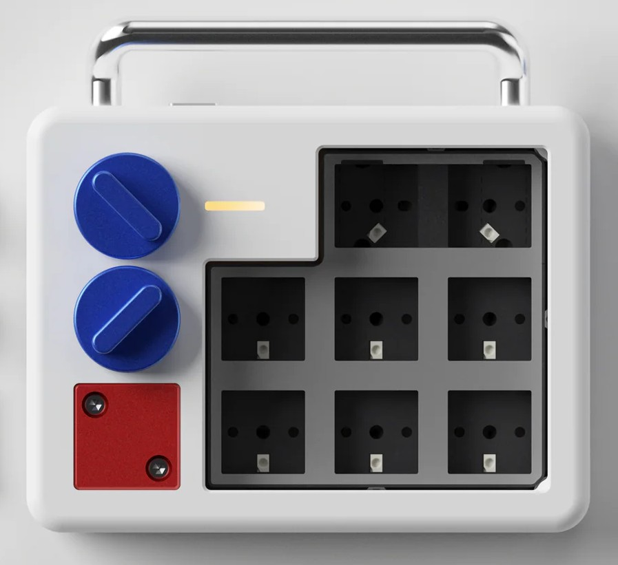

# Deadline Doys Macro Pad - Community Documentation

> **Note:** This documentation is community-driven and compiled from user discussions in the Deadline Discord channel, as no official documentation is currently available.

## Overview

The Deadline Doys macro pad is a custom mechanical device designed for shortcuts and macro functions. It supports both USB and Bluetooth connectivity, features RGB backlighting, and is compatible with VIA for key mapping. Deadline Studio website - <https://deadline.space/>

## Features

- Two rotary encoders / knobs
- RGB backlighting
- USB and Bluetooth connectivity (2 BLE channels)
- VIA compatibility for custom key mapping
- QMK-based firmware
- 3x4 key matrix layout
- Hot-swappable switches (MX compatible)

## Device Specifications

- **Vendor ID:** `0xAA96`
- **Product ID:** `0xAAF6`
- **Matrix:** 3 rows × 4 columns
- **Layout Options:** Standard or 2U top key
- **Switch Compatibility:** MX and MX clone switches

## Quick Start

### Essential Controls

- **Power off device:** Hold 2nd knob + press bottom right key (key 8)
- **Toggle backlight:** Hold 2nd knob + press bottom right key (USB only)
- **Disable Bluetooth:** Hold 2nd knob + press bottom left key

### Required Files

- **JSON Device Definition:** `./info-via-DoysPadBle.json` (pulled from Discord channel below)
- **Discord Channel:** <https://discord.com/channels/958628217730777088/1193866802984386620>

## Setup Guide

### Initial Setup

1. **Download the JSON file** `./info-via-DoysPadBle.json`

2. **Close interfering applications** (SignalRGB, etc.)
3. **Connect USB cabled** must be wired for VIA configuration

### VIA Configuration

1. **[Open VIA](https://usevia.app/)** and go to Settings
2. **Enable Design Tab** then click into the tab
3. **Upload JSON file** using the "Load" function
4. **Refresh VIA** if device doesn't appear immediately

### Bluetooth Pairing

1. **Load JSON file** in VIA first
2. **Bind a key to BLE Channel 1** (use `BLE_1` custom keycode, this is already done with the VIA config mentioned above)
3. **Press the BLE Channel 1 key** - look for green blinking light on macro pad
4. **Pair from your device** when green light appears
5. **Confirm connection** - key will blink blue briefly when connected

**Bluetooth Tips:**

- Keep device close to receiver during pairing
- Position facing toward receiver for best stability

## Default Layout

### Layer 0 (Default)

| Position        | Default Function       |
| --------------- | ---------------------- |
| Key 1           | Page Up                |
| Key 2           | Page Down              |
| Key 3-8         | F1, F2, F3, F4, F5, F6 |
| Encoder 1       | Volume Up/Down         |
| Encoder 1 Press | Mute                   |
| Encoder 2       | RGB Brightness Up/Down |
| Encoder 2 Hold  | Enable next layer      |

### Layer 1 (Work in Progress)

#### Access by holding 2nd knob

| Position | Function                       |
| -------- | ------------------------------ |
| Key 1    |                                |
| Key 2    |                                |
| Key 3    |                                |
| Key 4    |                                |
| Key 4    |                                |
| Key 6    |                                |
| Key 7    |                                |
| Key 8    | Turn off RGB / Turn off device |

## Available Custom Keycodes

- **WinLock** - Toggle Windows Key Lock
- **CG_TOG** - Swap Ctrl and Gui
- **Mission Control** - macOS Mission Control
- **Launch Pad** - macOS Launch Pad
- **TRGB_TOG** - Toggle TOP RGB
- **BAT_SHOW** - Show battery level light
- **USB_TOG** - Toggle USB Output
- **BLE_1/BLE_2** - Switch BLE Channels
- **BLE_OFF** - Disconnect BLE

## Basic Troubleshooting

### Device Not Recognized

1. Ensure JSON file is uploaded in VIA
2. Close USB-interfering applications
3. Try refreshing VIA
4. Test both USB and Bluetooth connections

### Hard Reset Procedure

If device becomes unresponsive:

1. Take apart device and remove the battery
2. Press and hold reset button (key 8)
3. Insert USB cable while holding button
4. Wait, then reinsert battery

### Common Issues

For detailed troubleshooting including rotary encoder problems, Bluetooth issues, power management, and more, see: **[KNOWN-ISSUES.md](KNOWN-ISSUES.md)**

## Software Compatibility

- **VIA:** ✅ Compatible (requires JSON file)
- **Vial:** ✅ Compatible (requires JSON file)
- **QMK:** ❌ Not directly compatible
- **Platforms:** macOS, Windows, Linux

### Current Limitations

- Advanced RGB features require direct QMK access (unavailable)
- Firmware source code not publicly available
- Cannot fix certain hardware issues (rotary encoder problems)

## Community Resources

- **Discord Main Channel:** [Deadline Discord server](https://discord.com/channels/958628217730777088/1193866802984386620). Select channel named `#doys`.

- **Known Issues:** [KNOWN-ISSUES.md](KNOWN-ISSUES.md). Community sourced troubleshooting guide for some reported issues

## Contributing

This documentation is community-maintained. To contribute please open a new issue or pull request with suggested changes or any new findings.

**Important:** Due to the complexity of setup and various known issues, joining the Discord community is strongly recommended before attempting to configure your device.
